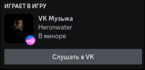

  
  <h1 align="center">VK Music RPC</h1>
  
Проприетарное ПО позволяющее обновлять статус в Discord на основе текущего трека в VK.

  <blockquote>
    
Данный проект никак не относится к компании "VK" и разрабатывается независимым разработчиком.

  </blockquote>
  <table align="center">
        <tr>
            <td><h4><a href="https://github.com/hinqiwame/vkm-rpc/wiki/%D0%A3%D1%81%D1%82%D0%B0%D0%BD%D0%BE%D0%B2%D0%BA%D0%B0#windows">Windows</a></h3></td>
            <td><h4><a href="https://github.com/hinqiwame/vkm-rpc/wiki/%D0%A3%D1%81%D1%82%D0%B0%D0%BD%D0%BE%D0%B2%D0%BA%D0%B0#linux">Linux</a></h4></td>
        </tr>
    </table>

---

  
  

---
Если вам понравился мой проект, вы можете поблагодарить меня по адресам следующих криптокошельков (пожалуйста)
- BTC: `bc1qplphlvwzxrfn73q8gcltr0sd5w0yglg4krukd5`
- ETH: `0x4FAe7A35439b89047F38bF74f38a1641F9D5c80A`
- TRX: `TK9YrNuqbTMac2r4ZP7SpBwiamYCsuoQg6`
- USDT (ERC20): `0x4FAe7A35439b89047F38bF74f38a1641F9D5c80A`
